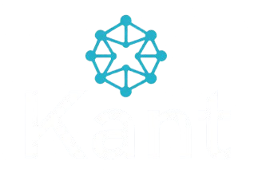

<div align="center">
  

  <p><strong>Serverless. End-to-end encrypted. Peer-to-peer.</strong></p>

  <p>
    <a href="https://kant.network"></a>
    <a href="https://discord.gg/kant"></a>
    <a href="LICENSE"></a>
    <a href="docs/security"></a>
  </p>
  <p>
    
    
    
    
  </p>

  <p>
    <a href="https://kant.network/how-it-works">How it works</a> ·
    <a href="https://kant.network/why-kant">Why Kant</a> ·
    <a href="https://kant.network/security">Security</a> ·
    <a href="https://kant.network/community">Community</a>
  </p>
</div>

---

Kant is a secure peer-to-peer messaging platform built around libp2p, libsodium, and a stateless circuit relay bootstrap node. The repository is organized as a monorepo with a web client, a relay runtime, and a shared core library.

This project is the working product core for encrypted messaging and relay-assisted peer connectivity. The free community build is intended for personal, academic, journalism, and security research use. The admin plane, governance tooling, and broader enterprise bundle are reserved for commercial/corporate use under the project license.

> 💬 **The project happens in the open.** Protocol decisions, relay operations, and the roadmap are discussed on [Discord](https://discord.gg/kant) — not in a support ticket queue. Come argue about the ratchet with us.

<table>
<tr>
<td width="33%" valign="top">

### 🔒 Control
Run your own relay and connect clients to a network you operate. Nobody else's infrastructure sits between you and your peers.

</td>
<td width="33%" valign="top">

### 🕶️ Privacy posture
The relay is intentionally not the message store. It never processes plaintext content — it forwards ciphertext and nothing else.

</td>
<td width="33%" valign="top">

### 📡 Reachability
Built on libp2p and circuit-relay v2, designed for peers behind NAT, firewalls, and mobile network churn.

</td>
</tr>
<tr>
<td width="33%" valign="top">

### 📊 Operational transparency
Health, readiness, metrics, and registry endpoints are built into the runtime — you can watch exactly what it's doing.

</td>
<td width="33%" valign="top">

### 🧩 Platform independence
Client and relay are decoupled enough to support self-hosted or fully customized network designs.

</td>
<td width="33%" valign="top">

### 🧅 Route awareness
Optional multi-hop onion routing with cover traffic, for peers who want to hide routing metadata too.

</td>
</tr>
</table>

---

## Commercial model and corporate bundle

The project license distinguishes clearly between free community use and paid commercial use:

- community / non-commercial use is free and intended for personal, academic, research, and similar use cases
- commercial use requires a written commercial license
- the paid corporate bundle is designed for organisational deployments and includes the admin-focused features and governance controls that are not part of the free community build

This means the admin features are not a general consumer feature. They are part of the corporate bundle and are meant for enterprise deployment, internal control, auditability, and managed operational governance.

At a product level, the repo reflects that split:

- core messaging, relay connectivity, and app functionality are the product base
- admin, policy, audit, and operational control features are positioned as a paid corporate layer
- the free build remains the community baseline without the corporate governance toolkit

---

## Product focus

Kant is designed for real-world peer connectivity in environments where direct peer-to-peer reachability is limited by NAT, firewalls, and mobile network churn.

The current implementation includes:

- encrypted peer identity and session primitives in the core package
- a browser client for relay-connected messaging
- a dedicated relay service that exposes registry and health endpoints
- deterministic relay identities and stable public multiaddrs across restarts
- support for group messaging, file transfer, and relay-based discovery
- operational endpoints for health, readiness, metrics, and reservation visibility

The relay is intentionally stateless with respect to message plaintext and relies on signed registry records and replay-resistant nonce verification for integrity.

---

## Why teams choose Kant

Kant is positioned for teams that want messaging infrastructure with less dependence on a centralized provider, better control over routing and relay topology, and a product architecture that is designed to work across NAT-heavy environments.

### The value proposition

- Control: run your own relay, connect clients to a network you operate
- Privacy posture: the relay is intentionally not the message store and does not process plaintext content
- Reachability: libp2p + circuit relay v2 is designed for peers behind NAT and firewall constraints
- Operational transparency: health, readiness, metrics, and registry endpoints are built into the runtime
- Platform independence: the client and relay are decoupled enough to support self-hosted or customized network designs

### Best fit

Kant is a strong fit for organizations evaluating a secure messaging layer that: 

- want self-hosted network control
- need peer connectivity in challenging network conditions
- prefer a relay-first architecture over pure centralized cloud messaging
- want a product surface that can evolve toward larger enterprise governance later

This is a product that starts from infrastructure control and secure transport, rather than a prebuilt admin SaaS layer.

---

## Competitive comparison

The comparison below is intentionally framed around product strategy and architecture, not inflated claims about unimplemented admin tooling.

| Category | Kant | Signal | Telegram | WhatsApp | Matrix |
| :--- | :--- | :--- | :--- | :--- | :--- |
| Core model | Relay-assisted P2P messaging with libp2p and peer registry | Centralized messaging service | Centralized messaging service with optional secret chats | Centralized messaging service | Federated, server-based messaging network |
| Infrastructure ownership | Self-hosted relay possible; app connects to operator-controlled relay | Provider-controlled infrastructure | Provider-controlled infrastructure; self-hosting is possible but not the default product model | Provider-controlled infrastructure | Strong self-hosting support via homeservers |
| NAT / connectivity strategy | Built for NAT traversal via circuit relay v2 and relay-assisted peer discovery | Depends on provider infrastructure | Depends on provider infrastructure | Depends on provider infrastructure | Depends on server federation and homeserver connectivity |
| Privacy posture | Relay does not hold plaintext; registry and routing metadata remain operational concerns | End-to-end encryption by default, with provider-managed infrastructure | E2EE exists in secret chats; cloud metadata still matters | E2EE exists, but provider ecosystem remains centralized | End-to-end encryption is available, but federation and server policies matter |
| Operational visibility | Health, readiness, metrics, registry endpoints included in the codebase | Mostly provider-side control plane | Provider-side control plane | Provider-side control plane | Org-controlled server operations, but app experience is more federation-centric |
| Admin model | Current repo includes reservation/admin debug endpoints, but not a full enterprise admin plane | Provider-managed admin tools | Provider-managed admin tools | Provider-managed admin tools | Homeserver admin tooling exists, but not a comparable end-user messaging product story |
| Ideal customer | Teams that value infrastructure ownership, secure routing, and relay control | Users wanting simple secure messaging immediately | Users prioritizing scale and messaging convenience | Users already embedded in the Meta ecosystem | Organizations with a strong self-hosted federation strategy |
| Current maturity | Core product stack exists; admin layer is intentionally not the main scope yet | Mature consumer platform | Mature consumer platform | Mature consumer platform | Mature open ecosystem |

### Decision summary

A buyer choosing Kant is choosing a different value equation than a mainstream consumer app:

- the product is strongest where infrastructure control matters more than polished consumer convenience
- the relay-first design is better aligned with teams operating behind NAT, inside internal networks, or across geographically distributed edge deployments
- the product is not positioned as a full SaaS admin suite yet; it is positioned as a secure, self-hostable messaging substrate with a clear path to enterprise extension

### Positioning against the strongest alternatives

| Alternative | Why buyers pick it | Why Kant is the better fit |
| :--- | :--- | :--- |
| Signal | Simple, familiar, strong privacy reputation | Better for teams that need relay infrastructure control and self-hosted routing choices instead of provider dependence |
| Telegram | Scale, convenience, broad user adoption | Better for organizations that want a privacy-first architecture with lower reliance on a centralized provider model |
| WhatsApp | Ubiquity and mainstream adoption | Better for teams that need self-hosting options, peer connectivity behind NAT, and infrastructure ownership |
| Matrix | Open federation and self-hosting strengths | Better when an organization wants a more relay-aware, encrypted peer-to-peer architecture with direct control over connectivity and public relay placement |

### Who should choose Kant

- security-conscious teams that want more control over network topology
- organizations operating across mobile, remote, or NAT-heavy environments
- teams that want a messaging stack with a self-hostable relay and measurable operational surfaces
- buyers evaluating a secure communication layer instead of a generic consumer app

### Who should not choose Kant yet

- teams that need a polished consumer messaging feature set immediately and do not care about infrastructure ownership
- organizations looking for a full enterprise admin SaaS bundle before the product matures further
- buyers expecting a completed admin console, policy engine, or managed compliance suite as part of the current repo

---

## Architecture

### Core runtime

The shared core package implements the primary platform primitives:

- identity generation and persistence
- X3DH and ratchet logic
- prekey and OPK flows
- contact and conversation storage
- group key handling and message delivery
- file transfer primitives
- license-related feature gates
- libp2p node creation and peer dialing logic

The implementation is centered in [packages/core/src/index.ts](packages/core/src/index.ts).

### Relay service

The relay is a libp2p circuit relay v2 bootstrap node. It exposes:

- /relay-info
- /healthz
- /readyz
- /metrics
- /register
- /lookup
- /report/opk-burn-failure
- /admin/reservations with bearer-token auth when configured

The relay keeps a signed registry of peer addresses, tracks nonces to reject replay attempts, and evicts stale entries based on TTL and disconnect events. It also exposes Prometheus metrics for operational visibility.

The primary implementation is in [packages/relay/src/index.ts](packages/relay/src/index.ts).

### Push proxy service

Kant uses a dedicated push proxy for Android delivery. This keeps Firebase credentials out of every relay and preserves the correct self-hosted architecture:

- relay operators do not need Firebase service accounts
- the push proxy is the single trust boundary for FCM delivery
- the relay sends a wake signal only, never message content
- the device reconnects over libp2p and receives the real encrypted payload after waking

The open-source implementation is in [packages/push-proxy/src/index.ts](packages/push-proxy/src/index.ts), and the self-hosted deployment bundle is available in [docker-compose.push-proxy.yml](docker-compose.push-proxy.yml) and [.env.push-proxy.example](.env.push-proxy.example).

### Client application

The app is a React + Vite interface that connects to a relay, starts a libp2p node, and provides user-facing messaging. It supports local relay configuration and remote relay URLs, with runtime selection of the active relay endpoint.

Key entry points:

- [packages/app/src/App.tsx](packages/app/src/App.tsx)
- [packages/app/src/hooks/useKant.ts](packages/app/src/hooks/useKant.ts)
- [packages/app/src/components/RelaySetupScreen.tsx](packages/app/src/components/RelaySetupScreen.tsx)

---

## Security model

Kant is designed around relay-assisted privacy rather than full central-server custody.

The codebase explicitly models the following:

- the relay does not store message plaintext
- peers register signed circuit addresses through the registry endpoint
- registry entries expire and are pruned on TTL and disconnect events
- duplicate nonces are rejected to prevent replay of registration or lookup requests
- admin reservation endpoints are not exposed unless a bearer token is configured
- the public relay host and port are intentionally separated from the bind address for correct multiaddr publication

This is a disciplined, operationally transparent messaging substrate rather than a blanket enterprise compliance claim.

---

## Repository layout

```text
.
├── README.md
├── package.json
├── pnpm-workspace.yaml
├── start.sh
├── docker-compose.http.yml
├── docker-compose.https.yml
├── docker-compose.push-proxy.yml
├── RELAY_DEPLOY.md
├── REPO_SETUP.md
├── assets/
├── docs/
├── packages/
│   ├── app/
│   ├── cli/
│   ├── core/
│   ├── desktop/
│   ├── push-proxy/
│   ├── relay/
│   ├── site/
│   └── admin/
├── tests/
├── ops/
└── LICENSE
```

### Package responsibilities

| Package | Purpose |
| :--- | :--- |
| [packages/core](packages/core) | crypto, identities, messaging primitives, discovery, groups, file handling |
| [packages/relay](packages/relay) | circuit relay bootstrap node, registry, metrics, health checks |
| [packages/app](packages/app) | React web client |
| [packages/desktop](packages/desktop) | desktop packaging and host integration |
| [packages/cli](packages/cli) | command-line interface surface |
| [packages/push-proxy](packages/push-proxy) | Firebase-holding wake-signal proxy for Android push, isolated from relay operators |
| [packages/site](packages/site) | the [kant.network](https://kant.network) marketing/wiki site (Next.js) |
| [packages/admin](packages/admin) | placeholder status; not an active product surface |

---

## Local development

### Prerequisites

- Node.js 20+
- pnpm
- Docker for relay orchestration

### Install dependencies

```bash
git clone https://github.com/CecuTheMag/Kant.git
cd Kant
npx pnpm install
```

### Start the app against a relay

The app does not manage the relay lifecycle itself. Start the relay separately and then point the app at it.

#### Option A: use the Docker relay

```bash
# HTTP relay for local and LAN use
RELAY_PUBLIC_HOST=127.0.0.1 docker compose -f docker-compose.http.yml up -d --build
```

Then launch the app:

```bash
./start.sh --relay http://127.0.0.1:3001 --port 5173
```

#### Option B: use an external relay

```bash
./start.sh --relay https://relay.example.com --port 5173
```

This matches the runtime behavior in [start.sh](start.sh): the app reads the relay URL from the environment or from the CLI override and connects to the relay without starting a local relay process.

---

## Production deployment

The project supports two deployment patterns:

### 1. Public relay behind TLS

The relay is designed to sit behind a TLS terminator such as Caddy or Nginx. The relay itself binds to a local port and advertises a public host and port. The code explicitly expects HTTPS/WSS delivery in front of the relay for internet-facing deployments.

The key runtime environment variables are defined in [packages/relay/src/index.ts](packages/relay/src/index.ts):

- RELAY_PORT
- RELAY_PUBLIC_PORT
- RELAY_INFO_PORT
- RELAY_PUBLIC_HOST
- RELAY_HTTP_BIND
- RELAY_DATA_DIR
- RELAY_SECURE
- RELAY_LAB_CONTROL_TOKEN

### 2. Local or LAN relay

For private environments or testing, the relay can be run over plain HTTP on the local network, as shown by the repository compose setup.

---

## Runtime health and monitoring

The relay exposes operational health endpoints for orchestration and monitoring:

```bash
curl http://127.0.0.1:3001/healthz
curl http://127.0.0.1:3001/readyz
curl http://127.0.0.1:3001/metrics
```

The relay also exposes registry information:

```bash
curl http://127.0.0.1:3001/relay-info
```

These endpoints are implemented in [packages/relay/src/index.ts](packages/relay/src/index.ts) and are the operational surface for deployment monitoring.

---

## Application configuration

The app uses a relay URL configured through the environment, with a fallback to a legacy HTTP-port variable. See [packages/app/.env.example](packages/app/.env.example).

Example:

```env
VITE_RELAY_URL=https://relay.example.com
# or
VITE_RELAY_HTTP_PORT=3001
```

The relay HTTP port is expected to serve the registry and health endpoints; the app then resolves the relay address from that host.

---

## Current scope and constraints

This repository currently represents the working product core for encrypted P2P communication, not the full enterprise admin control plane.

The live code explicitly includes:

- a relay and registry layer
- encrypted communication and group workflows
- operational health and metrics
- admin debug endpoints behind bearer auth

The code does not include a complete admin console, policy engine, or enterprise management plane. The admin package remains intentionally placeholder status, and the active product scope is the relay + app + core stack.

---

## Security and operations references

The repo contains operational guidance for deployment, incident handling, monitoring, and readiness review:

- [kant.network/security](https://kant.network/security) — the threat model and privacy posture, in plain language
- [RELAY_DEPLOY.md](RELAY_DEPLOY.md)
- [REPO_SETUP.md](REPO_SETUP.md)
- [docs/runbooks/monitoring.md](docs/runbooks/monitoring.md)
- [docs/runbooks/incident-response.md](docs/runbooks/incident-response.md)
- [docs/runbooks/backup-recovery.md](docs/runbooks/backup-recovery.md)
- [docs/runbooks/production-readiness.md](docs/runbooks/production-readiness.md)

---

## Community

Kant doesn't run a helpdesk. The Discord is where the actual work happens — protocol decisions, relay operations, and the roadmap, discussed by the people building and running it.

<div align="center">
  <a href="https://discord.gg/kant"></a>
</div>

---

## License

Kant is source-available under a dual-use licence: free for personal,
academic, journalism, and security research use; commercial use requires a
separate commercial licence. See [LICENSE](LICENSE) for full terms.
