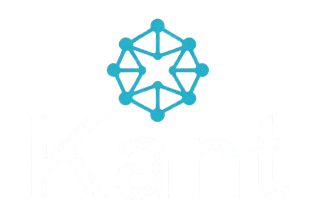

<div align="center">
  

  <p><strong>Private messaging, with no one in the middle.</strong></p>

  <p>
    <a href="https://kant.network"></a>
    <a href="https://discord.gg/kdn2tAPtRX"></a>
    <a href="https://t.me/kantmessenger"></a>
    <a href="https://x.com/kantmessenger"></a>
    <a href="https://www.instagram.com/kantmessenger/"></a>
    <a href="https://www.tiktok.com/@kantapps"></a>
    <a href="LICENSE"></a>
    <a href="docs/security"></a>
  </p>
  <p>
    
    
    
    
  </p>

  <p>
    <a href="https://kant.network/how-it-works">How it works</a> ·
    <a href="https://kant.network/why-kant">Why Kant</a> ·
    <a href="https://kant.network/security">Security</a> ·
    <a href="https://kant.network/community">Community</a>
  </p>
</div>

---

Kant is a free, open-source messenger that sends your messages straight to the people you're talking to. They're encrypted on your device and decrypted only on theirs. You don't need a phone number or an email address, and no company server keeps a copy.

When two devices can't reach each other directly (behind a home router, on mobile data, on a strict office network), a **relay** passes the encrypted message along. A relay can't read what it carries and doesn't store it. Anyone can run one: on a server, on a computer at home without opening a port, or inside the Kant desktop app itself.

> **Kant is in public beta** and hasn't had an independent security audit yet. The [threat model](docs/security/threat-model.md) and [kant.network/security](https://kant.network/security) say exactly what has been checked and what hasn't.

## What you get

- **End-to-end encryption with a new key for every message.** X3DH key agreement and a Double Ratchet built on libsodium, so one exposed key doesn't unlock the rest of a conversation.
- **No phone number, no email, no account.** Your identity is a key pair on your device, protected by your password. Add people by scanning their QR code or opening their invite link.
- **Groups, photos, files, voice messages and reactions.** Large files resume where they left off if the connection drops.
- **Works on difficult networks.** Built on libp2p with circuit relay v2, for devices behind NAT, firewalls and changing mobile connections.
- **Optional onion routing** with cover traffic, which makes it harder to see *who* you're talking to, not just what you say.
- **Fingerprint and Face ID unlock**, and moving your account to a new phone.
- **Free, with no ads and no subscriptions.** The messenger, relay and libraries are AGPL-3.0.

## Download

Every [release](https://github.com/CecuTheMag/Kant/releases/latest) is built from the tagged source by the [release workflow](.github/workflows/release.yml), and each file's SHA-256 is listed in the release's `SHA256SUMS.txt`. Check it before installing.

| Platform | File | Notes |
| --- | --- | --- |
| Android | `Kant-<version>.apk` | Signed with the project's release key. Android asks about installing from an unknown source, as it does for any app outside the Play Store. Add this repository to [Obtainium](https://github.com/ImranR98/Obtainium) to get update notifications. |
| iPhone | `Kant-<version>.ipa` | iOS 15 and later. Not on the App Store yet: install it with AltStore, SideStore or Sideloadly. With a free Apple ID, sideloaded apps have to be refreshed every 7 days. |
| macOS | `Kant-<version>-mac-arm64.dmg` (Apple Silicon) / `-mac-x64.dmg` (Intel) | Not notarized yet: the first time, open **System Settings → Privacy & Security** and choose **Open Anyway**. |
| Windows | `Kant-Setup-<version>-x64.exe` or the portable `Kant-<version>-x64-portable.exe` (`-arm64` for ARM PCs) | Not code-signed yet, so SmartScreen says the publisher is unknown: choose **More info → Run anyway**. |
| Linux | `Kant-<version>.AppImage` | No install needed: `chmod +x` and run. |

The desktop apps (macOS, Windows, Linux) include a built-in relay. You can also build any client from source; see [Development](#development).

## How it works

1. **You install Kant and pick a password.** Kant creates your identity keys on the device. Nothing is registered anywhere.
2. **You share your invite link or QR code** (`https://kant.network/add#k=<key>&n=<name>&r=<relay>`). Everything after `#` stays in the browser; the website never receives it.
3. **Your device registers its current address with a relay,** signed with your identity key so nobody else can claim to be you. Contacts look the address up and connect to you, directly or through the relay.
4. **Messages travel encrypted end to end.** The relay forwards encrypted frames it can't decrypt. If the other person is offline, *your* device holds the message and delivers it when they're back; the relay doesn't store it.
5. **Android phones are woken up for new messages** with a push signal that contains no message content. The phone then connects and fetches the encrypted message itself.

What a relay operator *can* see is who connects and when. If that matters to you, turn on onion routing, or run your own relay. Messages from people you haven't added arrive as **message requests** that you accept or block.

## Run your own relay

A relay keeps no messages. Pick whichever fits:

- **Inside the desktop app.** The macOS, Windows and Linux apps can run a relay for you and your contacts. See [RELAY_USER_GUIDE.md](RELAY_USER_GUIDE.md).
- **From home, without port forwarding.** One command sets up a relay behind Tailscale, Tailscale Funnel, Cloudflare Tunnel or ngrok, checks it from the outside, and prints the address to share. It works behind a router you can't configure or on a mobile connection:
  ```bash
  scripts/relay-tunnel.sh funnel
  ```
  See [RELAY_TUNNELS.md](RELAY_TUNNELS.md).
- **On a server.** `scripts/deploy-relay.sh` asks for what it needs (HTTPS with a domain, or HTTP on a local network), checks the domain points at the server, gets the certificate, and makes the keys for desktop notifications. See [RELAY_DEPLOY.md](RELAY_DEPLOY.md).

Anyone can switch relays in **Settings → Network → Relay**, and invite links carry the sharer's relay, so a friend who opens one is set up automatically.

**Relay on your home network?** Many home routers can't reach their own public address from inside the network (no "NAT hairpinning"). If devices at home can't connect through the relay's public address, enable NAT loopback on the router, or point those devices at the relay's local address instead.

## Security

- Messages are encrypted end to end on the device. The relay only forwards encrypted frames.
- Address records are signed with the owner's identity key, so nobody can publish an address on someone else's behalf.
- Every `/register` and `/lookup` request carries a one-time nonce; replays are rejected.
- Address records expire on a timer and are removed on disconnect.
- Relay admin endpoints don't exist unless a bearer token is configured.
- Push notifications carry a wake signal only, never message content.

Read the full [threat model](docs/security/threat-model.md) and [data policy](docs/security/privacy-data-policy.md). Report vulnerabilities as described in [SECURITY.md](SECURITY.md).

## For teams

Organisations can run Kant entirely on their own infrastructure. Kant is open core: everything except the corporate admin bundle (`packages/admin`) is AGPL-3.0, and a commercial licence is available for organisations that need one. See [docs/for-teams.md](docs/for-teams.md) for the licensing model, a comparison with Signal, Telegram, WhatsApp and Matrix, and what is and isn't built yet.

---

## Development

The rest of this page is for people building Kant or running it in production.

## Architecture

### Core runtime

The shared core package implements the primary platform primitives:

- identity generation and persistence
- X3DH and ratchet logic
- prekey and OPK flows
- contact and conversation storage
- group key handling and message delivery
- file transfer primitives
- license-related feature gates
- libp2p node creation and peer dialing logic

The implementation is centered in [packages/core/src/index.ts](packages/core/src/index.ts).

### Relay service

The relay is a libp2p circuit relay v2 bootstrap node. It exposes:

- /relay-info
- /healthz
- /readyz
- /metrics
- /register
- /lookup
- /report/opk-burn-failure
- /admin/reservations with bearer-token auth when configured

The relay keeps a signed registry of peer addresses, tracks nonces to reject replay attempts, and evicts stale entries based on TTL and disconnect events. It also exposes Prometheus metrics for operational visibility.

The primary implementation is in [packages/relay/src/index.ts](packages/relay/src/index.ts).

### Push proxy service

Kant uses a dedicated push proxy for Android delivery. This keeps Firebase credentials out of every relay and preserves the correct self-hosted architecture:

- relay operators do not need Firebase service accounts
- the push proxy is the single trust boundary for FCM delivery
- the relay sends a wake signal only, never message content
- the device reconnects over libp2p and receives the real encrypted payload after waking

The open-source implementation is in [packages/push-proxy/src/index.ts](packages/push-proxy/src/index.ts), and the self-hosted deployment bundle is available in [docker-compose.push-proxy.yml](docker-compose.push-proxy.yml) and [.env.push-proxy.example](.env.push-proxy.example).

### Client application

The app is a React + Vite interface (also packaged for Android via Capacitor and desktop via Electron). It follows the device's light/dark setting and uses the platform's own system font.

Key entry points:

- [packages/app/src/App.tsx](packages/app/src/App.tsx) — routes between onboarding, unlock and the app
- [packages/app/src/ui/](packages/app/src/ui/) — every screen: onboarding, chat list, conversation, settings and sheets
- [packages/app/src/ui/core/realkant.tsx](packages/app/src/ui/core/realkant.tsx) — the store the UI talks to, backed by `useKant` + `useGroups`
- [packages/app/src/hooks/useKant.ts](packages/app/src/hooks/useKant.ts) — identity, sessions, transport and message handling

People add each other by scanning a QR code or sharing an invite link (`https://kant.network/add#k=<key>&n=<name>&r=<relay>`). The part after `#` never leaves the device — the website's `/add` page reads it in the browser. Messages from someone you haven't added arrive as **message requests** you can accept or block.

---

## Repository layout

```text
.
├── README.md
├── package.json
├── pnpm-workspace.yaml
├── start.sh
├── docker-compose.http.yml
├── docker-compose.https.yml
├── docker-compose.push-proxy.yml
├── RELAY_DEPLOY.md
├── REPO_SETUP.md
├── assets/
├── docs/
├── packages/
│   ├── app/
│   ├── cli/
│   ├── core/
│   ├── desktop/
│   ├── push-proxy/
│   ├── relay/
│   ├── site/
│   └── admin/
├── tests/
├── ops/
└── LICENSE
```

### Package responsibilities

| Package | Purpose |
| :--- | :--- |
| [packages/core](packages/core) | crypto, identities, messaging primitives, discovery, groups, file handling |
| [packages/relay](packages/relay) | circuit relay bootstrap node, registry, metrics, health checks |
| [packages/app](packages/app) | React web client |
| [packages/desktop](packages/desktop) | desktop packaging and host integration |
| [packages/cli](packages/cli) | command-line interface surface |
| [packages/push-proxy](packages/push-proxy) | Firebase-holding wake-signal proxy for Android push, isolated from relay operators |
| [packages/site](packages/site) | the [kant.network](https://kant.network) marketing/wiki site (Next.js) |
| [packages/admin](packages/admin) | placeholder status; not an active product surface |

---

## Local development

### Prerequisites

- Node.js 20+
- pnpm
- Docker for relay orchestration

### Install dependencies

```bash
git clone https://github.com/CecuTheMag/Kant.git
cd Kant
npx pnpm install
```

### Start the app against a relay

The app does not manage the relay lifecycle itself. Start the relay separately and then point the app at it.

#### Option A: use the Docker relay

```bash
# HTTP relay for local and LAN use
RELAY_PUBLIC_HOST=127.0.0.1 docker compose -f docker-compose.http.yml up -d --build
```

Then launch the app:

```bash
./start.sh --relay http://127.0.0.1:3001 --port 5173
```

#### Option B: use an external relay

```bash
./start.sh --relay https://relay.example.com --port 5173
```

This matches the runtime behavior in [start.sh](start.sh): the app reads the relay URL from the environment or from the CLI override and connects to the relay without starting a local relay process.

### Running the tests

CI ([`.github/workflows/ci.yml`](.github/workflows/ci.yml)) runs the unit tests, typechecks and builds on every push. Before a release, also run the two browser suites, which drive the real app against real relays:

```bash
# Unit tests: crypto, protocol, relay, app logic
pnpm --dir packages/core test && pnpm --dir packages/core run test:federation
pnpm --dir packages/relay build && pnpm --dir packages/relay test
pnpm --dir packages/app test

# Docker lab: messaging, offline delivery, ordering, 1 MiB files, relay restarts,
# group churn and 10-member groups, through the real UI (needs Docker)
docker compose -f tests/lab/docker-compose.yml build
tests/lab/scripts/profile-up.sh lan
docker compose -f tests/lab/docker-compose.yml run --rm runner pnpm --dir tests/lab test
docker compose -f tests/lab/docker-compose.yml run --rm runner pnpm --dir tests/lab test:ui
docker compose -f tests/lab/docker-compose.yml down --remove-orphans

# Devices switched off and on across two relays (~8 minutes)
pnpm run test:reconnect
```

The browser tests go through the same screens a person does, via the shared driver in [`tests/lab/tests/e2e-browser-helpers.mjs`](tests/lab/tests/e2e-browser-helpers.mjs) — when the UI changes, update it there.

### Building clients with a default relay

A release built **without** a default relay opens on a "Connect to a network" step, which asks people for a relay address or a friend's invite link. For a public release, build the clients with your relay baked in so people go straight from install → password → chatting:

```bash
VITE_RELAY_URL=https://relay.your-domain.example pnpm --dir packages/app run build:android
VITE_RELAY_URL=https://relay.your-domain.example pnpm --dir packages/desktop run build:linux
```

Replace `relay.your-domain.example` with your relay's public address. Official releases are built by the [release workflow](.github/workflows/release.yml), which reads the address from the `KANT_DEFAULT_RELAY` repository variable — see [docs/runbooks/release-process.md](docs/runbooks/release-process.md).

Anyone can still switch relays later in **Settings → Network → Relay**. Invite links include the sharer's relay (unless it's a loopback address), so a friend without a default network is set up automatically when they paste one.

---

## Production deployment

The project supports two deployment patterns:

### 1. Public relay behind TLS

The relay is designed to sit behind a TLS terminator such as Caddy or Nginx. The relay itself binds to a local port and advertises a public host and port. The code explicitly expects HTTPS/WSS delivery in front of the relay for internet-facing deployments.

The key runtime environment variables are defined in [packages/relay/src/index.ts](packages/relay/src/index.ts):

- RELAY_PORT
- RELAY_PUBLIC_PORT
- RELAY_INFO_PORT
- RELAY_PUBLIC_HOST
- RELAY_PUBLIC_URL (single-port mode for tunnels — see [RELAY_TUNNELS.md](RELAY_TUNNELS.md))
- RELAY_HTTP_BIND
- RELAY_DATA_DIR
- RELAY_SECURE
- RELAY_LAB_CONTROL_TOKEN

### 2. Local or LAN relay

For private environments or testing, the relay can be run over plain HTTP on the local network, as shown by the repository compose setup.

---

## Runtime health and monitoring

The relay exposes operational health endpoints for orchestration and monitoring:

```bash
curl http://127.0.0.1:3001/healthz
curl http://127.0.0.1:3001/readyz
curl http://127.0.0.1:3001/metrics
```

The relay also exposes registry information:

```bash
curl http://127.0.0.1:3001/relay-info
```

These endpoints are implemented in [packages/relay/src/index.ts](packages/relay/src/index.ts) and are the operational surface for deployment monitoring.

---

## Application configuration

The app uses a relay URL configured through the environment, with a fallback to a legacy HTTP-port variable. See [packages/app/.env.example](packages/app/.env.example).

Example:

```env
VITE_RELAY_URL=https://relay.example.com
# or
VITE_RELAY_HTTP_PORT=3001
```

The relay HTTP port is expected to serve the registry and health endpoints; the app then resolves the relay address from that host.

---
## Security and operations references

The repo contains operational guidance for deployment, incident handling, monitoring, and readiness review:

- [kant.network/security](https://kant.network/security) — the threat model and privacy posture, in plain language
- [RELAY_DEPLOY.md](RELAY_DEPLOY.md)
- [REPO_SETUP.md](REPO_SETUP.md)
- [docs/runbooks/monitoring.md](docs/runbooks/monitoring.md)
- [docs/runbooks/incident-response.md](docs/runbooks/incident-response.md)
- [docs/runbooks/backup-recovery.md](docs/runbooks/backup-recovery.md)
- [docs/runbooks/production-readiness.md](docs/runbooks/production-readiness.md)

---

## Community

Kant doesn't run a helpdesk. The Discord is where the actual work happens — protocol decisions, relay operations, and the roadmap, discussed by the people building and running it.

<div align="center">
  <a href="https://discord.gg/kdn2tAPtRX"></a>
</div>

---

## License

Kant is open core:

- **Everything in this repository except `packages/admin`** is licensed under
  the [GNU Affero General Public License v3.0](LICENSE) (`AGPL-3.0-only`).
  You can use, study, modify and share it. If you distribute a modified version,
  or run one as a network service (for example, a modified relay), you must
  make your source available under the same licence.
- **`packages/admin`** (the admin plane and corporate governance bundle) is
  under the [Kant Dual-Use Licence](packages/admin/LICENSE).
- **Commercial licences** that release you from the AGPL's obligations are
  available from [licensing@kant.network](mailto:licensing@kant.network).

The name "Kant" and the Kant logo are not covered by either licence. Forks are
welcome, but please give them a different name so people can tell them apart.

By contributing, you agree that your contribution is licensed under the
AGPL-3.0, and that the Kant Project may also distribute it under the commercial
licence, so that dual licensing stays possible.
